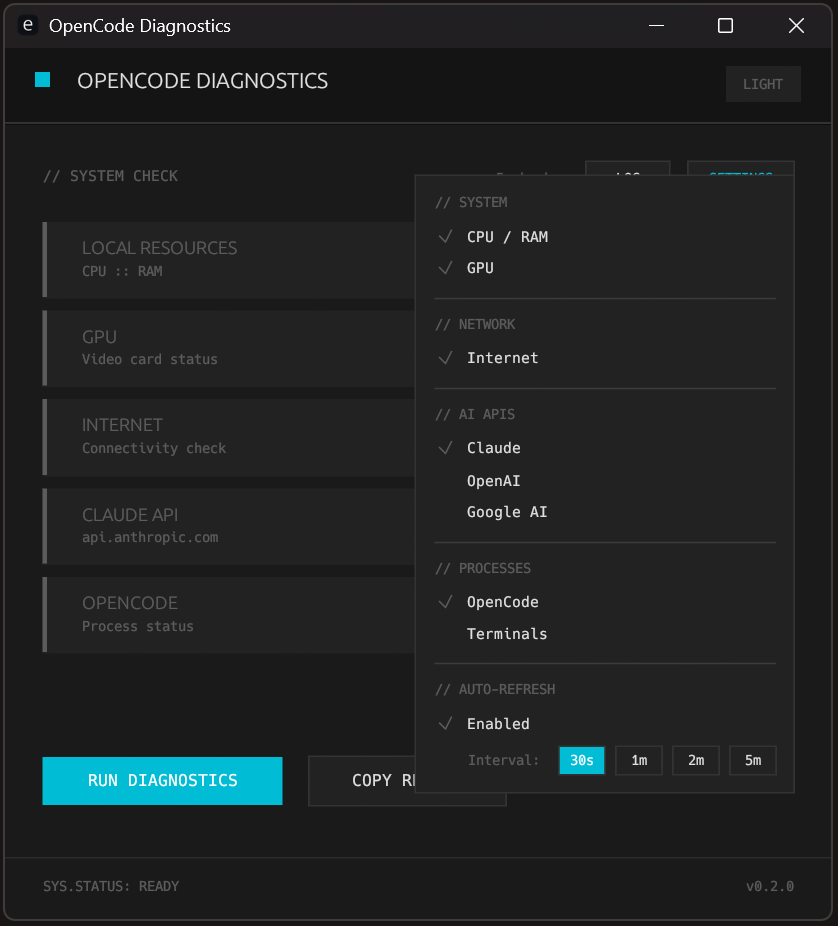
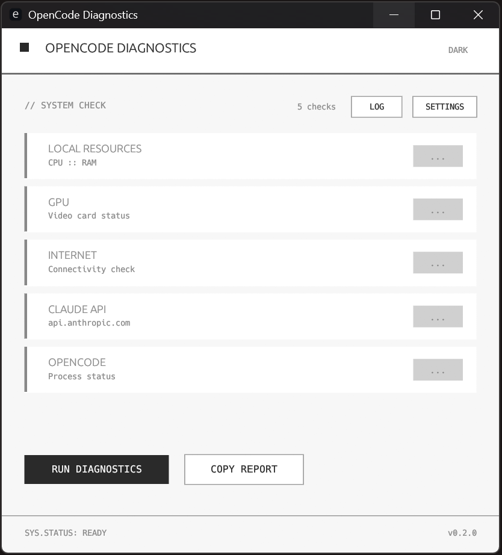

# OpenCode Diagnostics

A diagnostic tool for debugging "server at capacity" errors in OpenCode/Claude API connections.

Checks the full chain: **[Your PC] -> [Internet] -> [Claude API] -> [OpenCode]**

## Screenshots

| Dark Theme | Light Theme |
|------------|-------------|
|  |  |

## Features

- **System Monitoring** - CPU, RAM, GPU usage
- **Network Check** - Internet connectivity test
- **API Status** - Claude, OpenAI, Google AI availability
- **Process Detection** - OpenCode process and terminal count
- **Auto-refresh** - Automatic periodic checks (30s, 1m, 2m, 5m intervals)
- **Error Log** - Grouped error history with timestamps (only issues, not OK checks)
- **Light/Dark Theme** - Y2K clinical design aesthetic
- **Settings Persistence** - Saved to `%APPDATA%/opencode-diag/settings.json`
- **Copy Report** - One-click clipboard export

## Installation

### Download (Windows)

Download from [Releases](https://github.com/NyanDanKun/opencode-diag/releases)

### Build from source

```bash
git clone https://github.com/NyanDanKun/opencode-diag.git
cd opencode-diag
cargo build --release
```

Binary will be at `target/release/opencode-diag.exe`

### Requirements

- Windows 10/11 (uses WMI for GPU info)
- Rust 1.70+ (for building from source)

## Usage

```bash
# Run directly
cargo run --release

# Or run the built binary
./target/release/opencode-diag.exe
```

### Controls

| Button | Action |
|--------|--------|
| **RUN DIAGNOSTICS** | Start a diagnostic check |
| **SETTINGS** | Configure which checks to enable |
| **LOG** | View error history (only issues shown) |
| **COPY REPORT** | Copy results to clipboard |
| **LIGHT/DARK** | Toggle theme |

### Configurable Checks

- CPU / RAM
- GPU
- Internet
- Claude API
- OpenAI API
- Google AI
- OpenCode process
- Terminals

## Design

Built with [egui](https://github.com/emilk/egui) following a Y2K clinical design system:

- Sharp corners (no rounded edges)
- Monospace fonts
- Minimal color palette
- Technical aesthetic

See [DESIGN_SYSTEM.md](DESIGN_SYSTEM.md) for details.

## Dependencies

```toml
eframe = "0.29"      # GUI framework
sysinfo = "0.32"     # CPU/RAM monitoring
reqwest = { blocking } # HTTP requests
wmi = "0.14"         # Windows GPU info
serde = "1"          # Settings serialization
arboard = "3"        # Clipboard
chrono = "0.4"       # Timestamps
dirs = "5"           # Config paths
```

## License

MIT License - see [LICENSE](LICENSE)

## Author

Created by [NyanDanKun](https://github.com/NyanDanKun)
